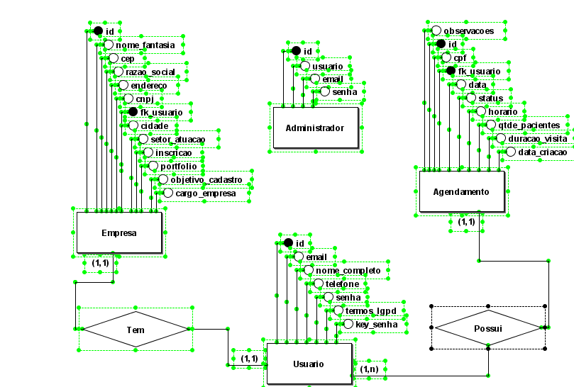

# 💾 Modelagem do Banco de Dados - VerSonhos

O repositório **VerSonhos_database** contém todos os artefatos de modelagem e implementação do banco de dados que suporta a aplicação **verSonhos.com.br**.

## 📖 Descrição Geral

Este banco de dados foi projetado para gerenciar todas as informações essenciais da plataforma VerSonhos, incluindo:

* **Usuários**;
* **Agendamentos**;
* **Administradores**.

A modelagem foi desenvolvida para garantir a **integridade**, **consistência** e **performance** necessárias para uma aplicação de comércio eletrônico ou gestão de plataforma.

---

## 🖼️ Diagrama Entidade-Relacionamento (MER/DER)

Abaixo, você pode visualizar o Diagrama Entidade-Relacionamento (DER), que representa visualmente as tabelas (entidades) do banco de dados e as relações entre elas, utilizando a notação padrão (provavelmente BrModelo, dado o arquivo `.brM3` presente).

### Diagrama

***Nota:** A imagem acima corresponde ao arquivo `MerDerVerSonhos.png` disponível na raiz do repositório.*

---

## 📦 Recursos do Repositório

O repositório contém arquivos cruciais para a compreensão e implementação deste modelo de banco de dados:

### 1. Dicionário de Dados

* **Arquivo:** `DicionarioDeDadosVerSonhos.xlsx`
* **Descrição:** Contém a documentação detalhada de cada tabela e coluna do banco de dados, especificando o nome da coluna, tipo de dado, restrições (PK, FK, NOT NULL) e uma descrição clara sobre seu propósito. É essencial para desenvolvedores e DBAs.

### 2. Script de Criação (SQL)

* **Arquivo:** `ScriptVerSonhos.sql`
* **Descrição:** O script SQL que pode ser executado em um SGBD compatível (ex: MySQL, PostgreSQL, etc.) para criar o esquema, todas as tabelas e definir as chaves primárias e estrangeiras do banco de dados, conforme o modelo.

### 3. Arquivo de Modelagem

* **Arquivo:** `MerDerVerSonhos.brM3`
* **Descrição:** O arquivo original do projeto de modelagem de dados, provavelmente gerado pela ferramenta BrModelo ou similar. Permite a edição, manipulação e geração de novos scripts ou diagramas do modelo.

---

## 🛠️ Tecnologias Envolvidas

* **Modelagem:** BrModelo (ou ferramenta compatível com `.brM3`)
* **Linguagem de Definição de Dados:** SQL (ScriptVerSonhos.sql)